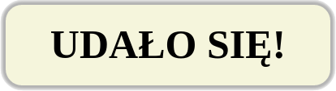

# Border i box shadow

### Zadanie 1
Stwórz element __div__ i nadaj mu klasę __popup__. Ostyluj element tak, aby uzyskać następujący wygląd:



Style:

* szerokość __400px__,
* wysokość __100px__,
* kolor tła __beige__,
* cień - wyśrodkowany, __5px__ rozmycie, __5px__ szerokość cienia, kolor __rgba(0,0,0,0.3)__,
* tekst wyśrodkowany w poziomie, wielkość czcionki __50px__, przesunięty od góry o __20px__, waga czcionki __700__,
* zaokrąglenie rogów __20px__.


### Zadanie 2 
W pliku html stwórz 3 elementy div w następujący sposób:
* Pierwszy o klasie ```ellipse``` - ustaw mu w pliku style.css:
  * szerokość: 180px
  * wysokość 100px
  * kolor tła lime
  * do zaokrąglenia rogów użyj skróconej wersji zapisu border-radius, wykorzystaj jednostkę %

* Drugi o klasie ```circle``` - ustaw mu w pliku style.css:
  * szerokość: 100px
  * wysokość 100px
  * kolor tła lime
  * do zaokrąglenia rogów użyj skróconej wersji zapisu border-radius, wykorzystaj jednostkę %
  
* Trzeci o klasie ```lime``` - ustaw mu w pliku style.css:
  * szerokość: 100px
  * wysokość 100px
  * kolor tła lime
  * do zaokrąglenia rogów użyj skróconej wersji zapisu border-radius, wykorzystaj jednostkę %

Niech poszczególne elementy po ostylowaniu wyglądają tak jak na obrazku niżej

|elipsa|koło|limonka|
|:--:|:--:|:--:|
| | |	|


